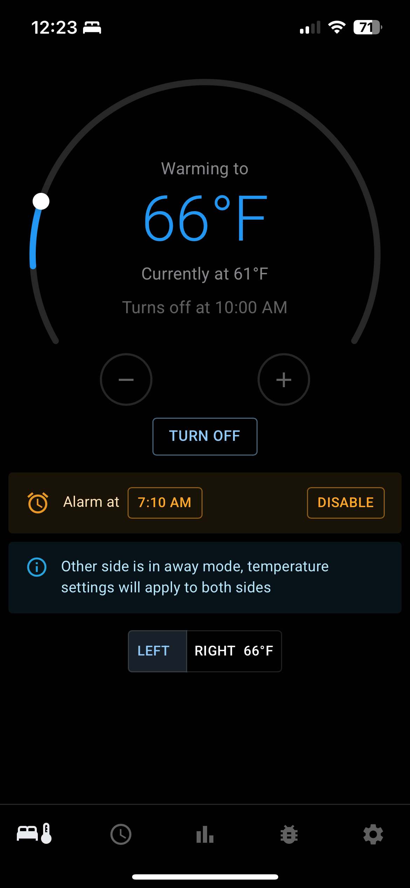
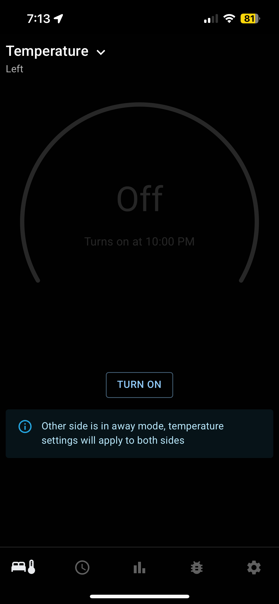
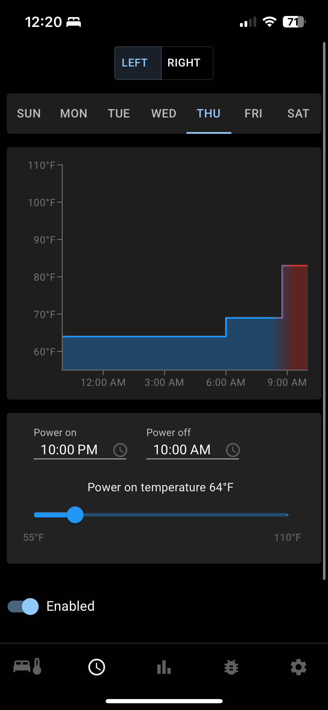
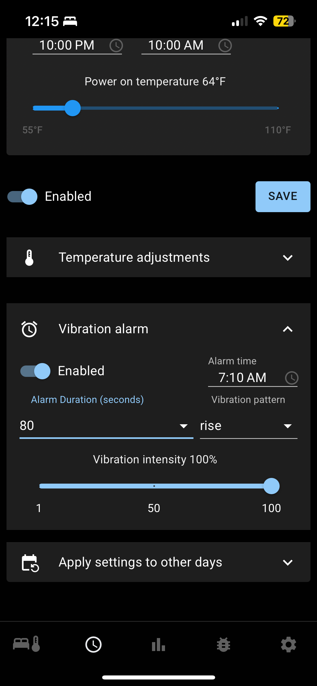
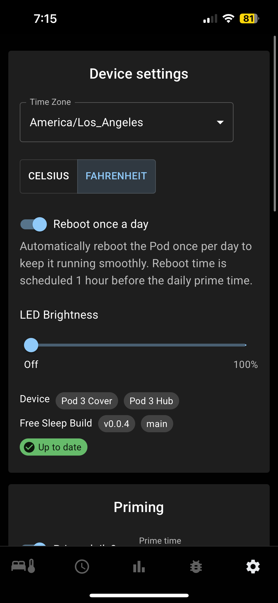
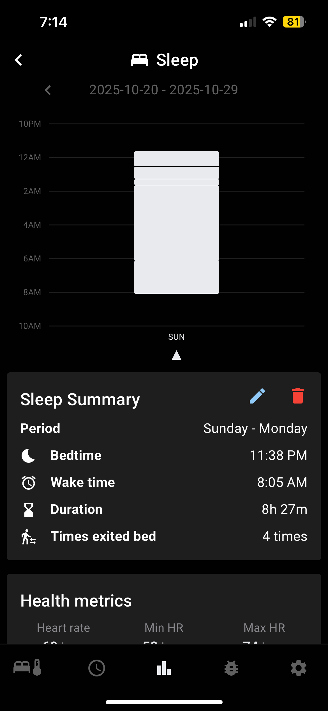
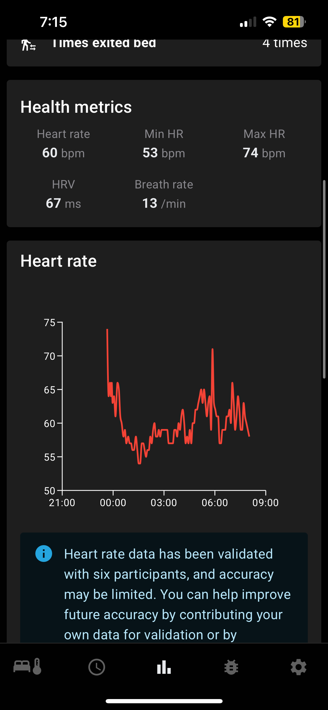
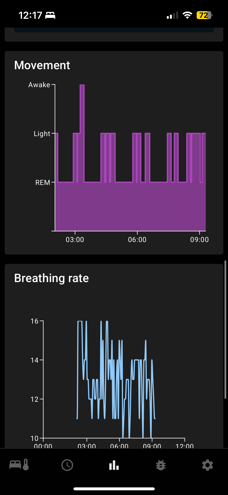
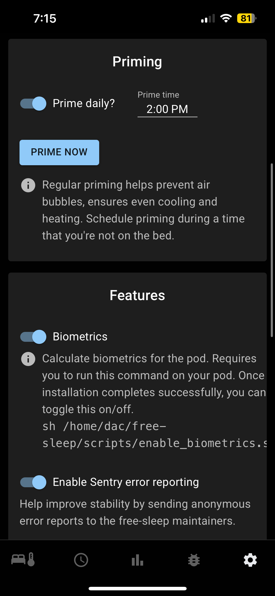
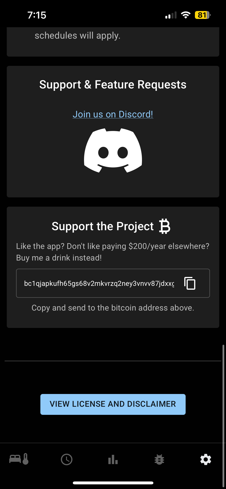

# Free Sleep — Local Control for 8 Sleep Pods

## 👀 [Demo App](https://free-sleep.vercel.app/)

## 💬 [Discord Server](https://discord.gg/JpArXnBgEj)
- Support
- Feature requests
- Updates
- Contributing

## [🤖 Custom ChatGPT Support Bot](https://chatgpt.com/g/g-68fb217791dc8191b82d2d0ae7b29940-free-sleep-bot)

- A custom ChatGPT with Free Sleep documentation and related resources. It can help troubleshoot installations, answer setup questions, and guide you through common issues.

---

## 🛠️ [Installation Instructions](./INSTALLATION.md) 🛠

--- 

## Overview
Free Sleep is an open-source project that lets you control your Eight Sleep Pod locally — without relying on the cloud or the official app.
Each Pod actually runs a small Linux computer inside it. Free Sleep installs a lightweight server on that computer, giving you full local control.
- **Server**: Runs directly on the Pod and talks to its hardware using custom APIs.
- **App**: A simple, user-friendly web interface for changing temperatures, schedules, alarms, and settings. See [app demo here](https://free-sleep.vercel.app/)

## Compatability
- Pod 1 - ❌ **NOT COMPATIBLE**
- Pod 2 - ❌ **NOT COMPATIBLE**
- Pod 3 - **(With SD card)** - ✅
- Pod 3 - **(No SD card)** - ✅ FCC ID: 2AYXT61100001 (The FCC ID is located in the back of the pod where you plug in the water tubes)
- Pod 4 ✅
- Pod 5 ✅

---  

---
## FAQ
### Is it reversible?
Yes, you can easily firmware reset the pod and go back to the official 8 Sleep App

### Will I brick my pod?
Pod 3 **without** the SD card, Pod 4, and Pod 5 are impossible to brick - _as long as you follow the directions_ 

### Will it void my warranty?
Free Sleep is not officially supported by 8 Sleep, so there’s always a chance it could affect your warranty.
That said, you can fully reset the firmware and return the Pod to its original state at any time, and there’s no permanent modification made to the hardware.

## Features
- Allows complete control of device WITHOUT requiring internet access. If you lose internet, your pod WILL NOT turn off, it will continue working! You can completely block WAN internet access if you'd like too. (I blocked all internet access from my pod on my router...)
- WARNING: This will bypass blocked devices, please use responsibly
- Dynamic temperature control with real-time updates
- Schedule management: 
  - Set power on/off times 
  - Schedule temperature adjustments
  - Schedule daily time to prime the pod
  - Alarms - If you turn off the Pod prior to the alarm running, then the alarm will not run
- Settings customization: Configure timezones, away mode, brightness of LED on pod
- Website works on desktop and mobile

### Biometrics 📈
- **The only biometrics data that has been validated is heart rate**, HRV & breathing rates have not been validated & may be inaccurate.
Heart rates were validated over 33 sleep periods from 3 males & 3 females against mostly Apple Watches. 
**Heart rate calculations tend to be slightly less accurate for females**
- Summary statistics for all 33 periods:
  - RMSE - 2.88 average, 1.45 min, 7.63 max 
  - Correlation - 80.8% average, 27% min, 95% max
  - MAE - 1.83 average, 1 min, 5.77 max
- How to enable:
  - `sh /home/dac/free-sleep/scripts/enable_biometrics.sh`
- How to disable:
  - `sh /home/dac/free-sleep/scripts/disable_biometrics.sh`

#### Biometrics Overview

All biometric and sleep data is inserted into SQLite @ `/persistent/free-sleep-data/free-sleep.db`.

1. Vitals (Heart rate, breath rate, HRV) `biometrics/stream/stream.py` - This runs 24/7 and calculates vitals when it detects presence.
Vitals are inserted once every 60 seconds & you can access the raw data @ <POD_IP>/api/metrics/vitals

---
## Technical details

### **Server**
- REST API for managing device settings, schedules, and status.
- Modular design with routes for `deviceStatus`, `settings`, `schedules`, and `execute`.
- Uses Node.js and Express for lightweight, fast operations.

---

## Tech Stack
- **Server**: Node.js, Express, TypeScript.
- **App**: React, Material-UI, Zustand, React Query.
- **Database**: LowDB for simple JSON-based storage.

## Contributing
- Read [contributing docs](CONTRIBUTING.md) 

### Developing
- [front-end](app/README_APP.md)
- [back-end](server/README_SERVER.md)

---

## Support

If you find this project helpful and would like to support its continued development, you can send a tip to my Bitcoin address or PayPal

- [PayPal](https://paypal.me/realfreesleep)
- BTC Address: `bc1qjapkufh65gs68v2mkvrzq2ney3vnvv87jdxxg6`

Thank you for your support!

---
## Supporters

### Sentry.io 
Sentry
has generously sponsored error monitoring for the Free Sleep open-source project.
Their support helps us maintain a more reliable experience for users by 
enabling real-time visibility into issues and performance data — thank you, Sentry, 
for supporting open-source innovation!

---

## License
This project is licensed under the MIT License. See the `LICENSE.md` file for details.

---

## Acknowledgments
- Huge thanks to [@bobobo1618](https://github.com/bobobo1618) & their research on how the device is controlled via dac.sock

---

## App screenshots

